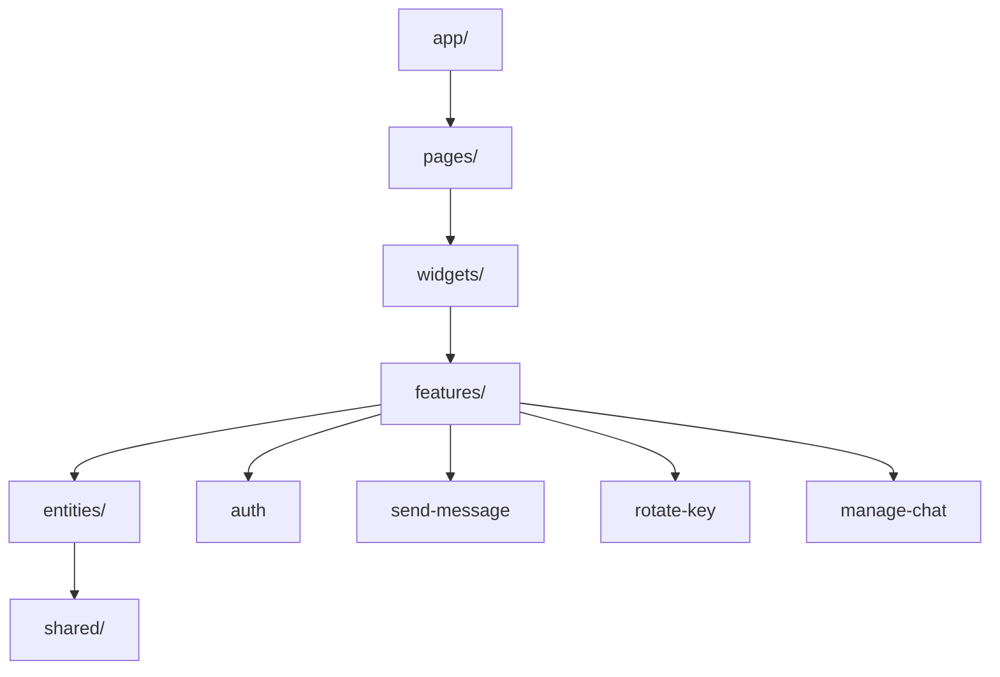
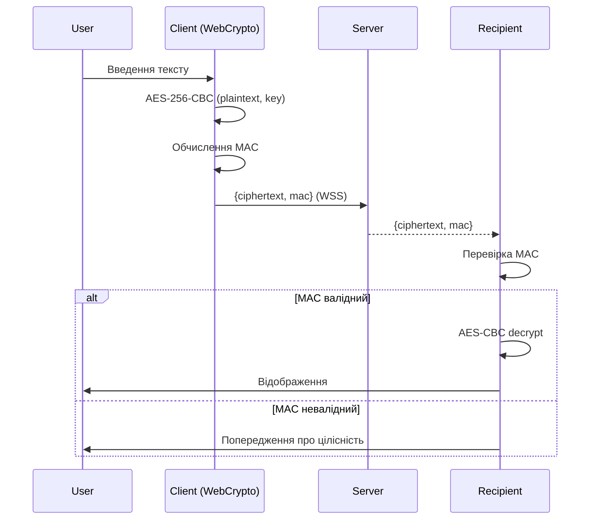
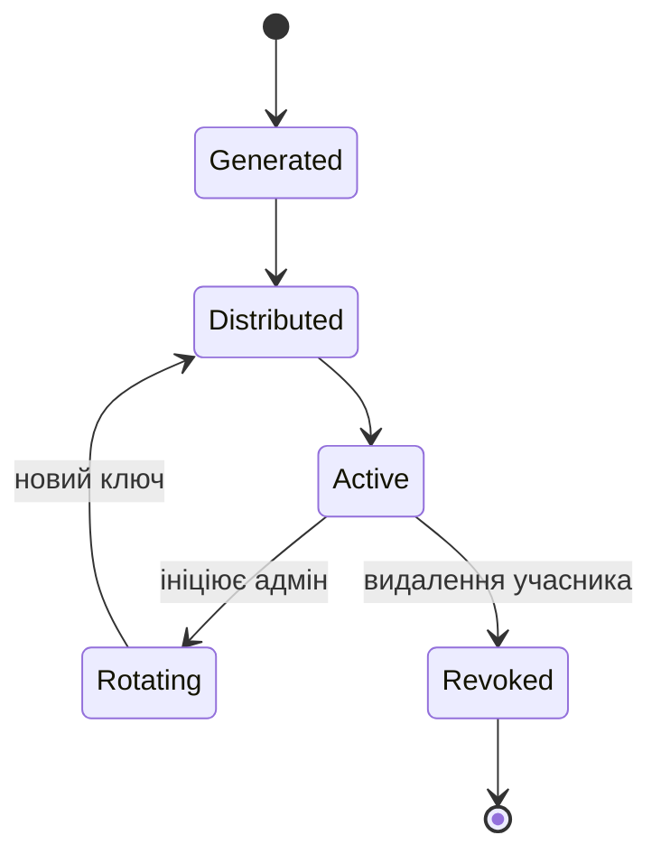
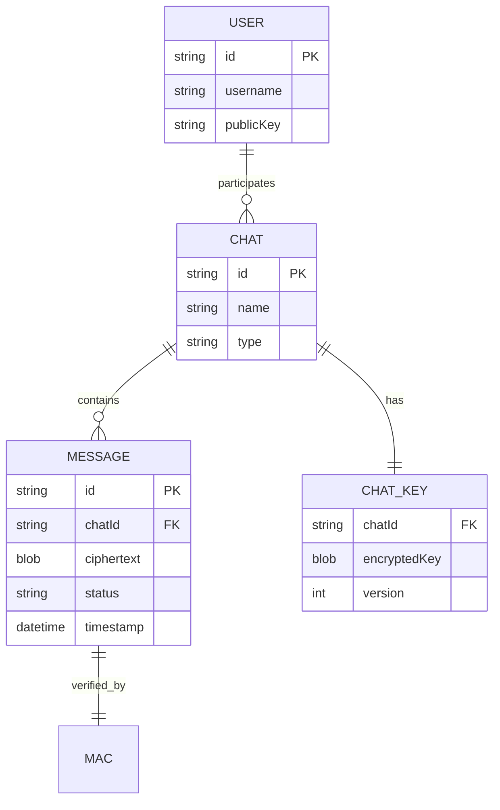
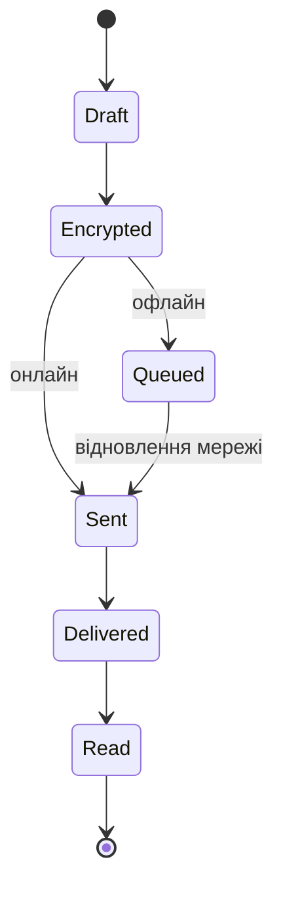
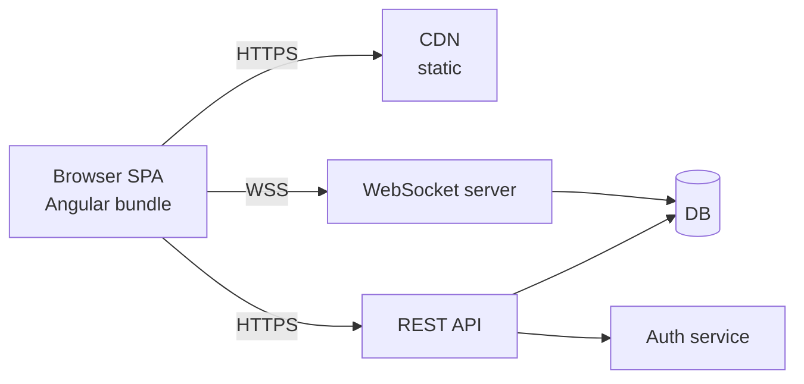

# Architecture Views - SorokChat Messenger

**Тип за ISO 15289:2019:** Description
**Стандарт:** ISO/IEC/IEEE 42010:2022

Тут наведено конкретні подання (Views) - реалізації точок зору
із `viewpoints.md`.

---

## View-01: Функціональне подання (реалізує VP-01)

### Діаграма компонентів (Mermaid)

### Ключові Use Cases
| UC | Назва | Пов'язані FR |
|----|--------|--------------|
| UC-01 | Реєстрація | FR-01 |
| UC-02 | Вхід | FR-02 |
| UC-03 | Створення чату | FR-04 |
| UC-04| Надсилання повідомлення | FR-08 |
| UC-05 | Ротація ключа | FR-06 |
| UC-06 | Перегляд офлайн | FR-09 |

### Правила FSD
- Залежності - лише зверзу донизу.
- Кожен слайс має `index.ts` у якості публічного API.

## View-02: Безпекове подання (VP-02)

### Модель загроз (STRIDE)

| Загроза | Приклад | Контрзахід |
|---------|---------|------------|
| Spoofing | Підміна користувача | 2FA, TLS, цифрові підписи |
| Tampering | Зміна повідомлення в дорозі | MAC (HMAC-SHA-256 / GCM) |
| Repudiation | Заперечення відправки | Цифровий підпис |
| Information disclosure | Читання сервером | E2E (AES-256-GCM) |
| Denial of service | Flood запитами | Rate limiting, WAF |
| Elevation of privilege | Ескалація прав | RBAC, перевірка на сервері |

### Життєвий цикл ключа

## View-03: Інформаційне подання (VP-03)

### ER-діаграма (локальне сховище, IndexedDB)

### Стан повідомлення

### Сховище браузера

| Сховище | Що зберігається | Термін |
|---------|-----------------|--------|
| IndexedDB | Повідомлення (ciphertext), чати | До logout |
| localStorage | Налаштування UI, мова | Постійно
| memory (in-tab) | Розшифровані ключі | До закриття вкладки |
| httpOnly cookie | Refresh token | 7 діб |

## View-04: Подання розгортання (VP-04)

### Deployment Diagram

### Вимоги до середовиша

| Компонент | Технологія | Примітка | 
|-----------|------------|----------|
| SPA bundle | Static hosting / CDN | gzip + brotli |
| REST API | Node (Nestjs) | TLS 1.3 |
| WebSocket | Окремий сервіс | Horizontal scaling |
| DB | PostgreSQL (метадані) | Без plaintext-повідомлень |

### Мережеві вимоги

- Усі з'єднання — HTTPS/WSS.
- HSTS enabled.
- CSP: заборона unsafe-inline, eval.