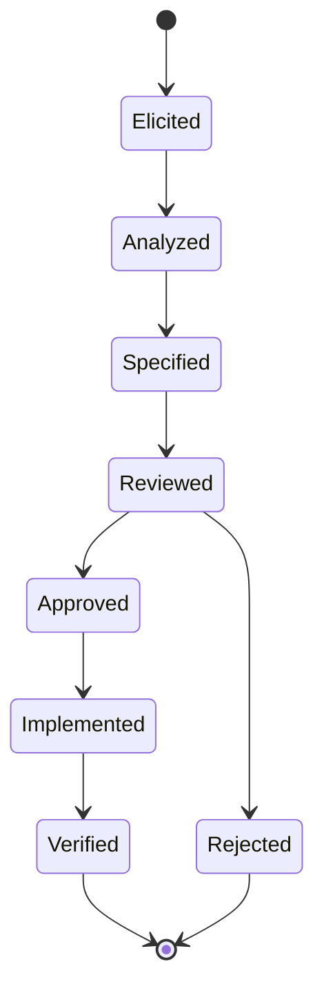

# Requirements Lifecycle Procedure - SorokChat Messenger

**Тип за ISO 15289:2019:** Procedure

**Версія:** 1.0

## 1. Мета

Опис кроків (work instructions) для роботи з вимогами відповідно
до ISO/IEC/IEEE 29148:2018.

## 2. Фази життєвого циклу вимоги

## 3. Покрокрві інструкції

### 3.1. Elicitattion (Виявлення)

Вхід: потреби стейтхолдерів, бізнес-цілі.
Дії:
1. Провести інтерв'ю із стейтхолдером.
2. Провести інтерв'ю зі стейкхолдером. 
Зафіксувати потреби у StRS (формат «Як <роль>, я хочу <дія>, щоб <цінність>»). Присвоїти ID (StR-xx).

Вихід: чернетка StRS.

### 3.2. Analysis (Аналіз)

Дії:
1. Перевірити кожну вимогу за 9 критеріями якості ISO 29148.
2. Визначити пріоритет (Critical/High/Medium/Low).
3. Виявити конфлікти з іншими вимогами.
4. Оцінити здійсненність.

Вихід: оновлений StRS + список конфліктів.

### 3.3. Specification (Специфікування)

Дії:
1. Трасувати StR → SyRS (системні вимоги).
2. Трасувати SyRS → SRS (програмні вимоги).
3. Додати критерії верифікації.

Вихід: SyRS, SRS.

### 3.5. Approval (Затвердження)
Дії:
1. Product Owner затверджує.
2. Merge у main.
3. Статус вимоги → Approved.

### 3.6. Implementation (Реалізація)

Дії:
1. Створити issue в GitHub з посиланням на ID вимоги.
2. Розробник реалізує фічу.
3. Комміт-повідомлення містить ID вимоги: feat(auth): implement FR-02.

### 3.7. Verification (Верифікація)

Дії:
1. Написати тести (unit / E2E).
2. Запустити CI.
3. Оновити `verification-report.md`.

## 4. Зміна вимоги
1. Будь-хто створює Change Request (див. `request/change-request-template.md`).
2. Заповнює вплив на архітектуру та тести.
3. Рев'ю та затвердження.
4. Оновлення всіх трасованих документів.

### 5. Артефакти
| Артефакт | Відповідальний | Частота оновлення |
|----------|---------------|--------------------|
| BRS | PM | Sprint | 0 |
| StRS | BA | Sprint 0, далі — за потребою |
| SyRS | Architect | Sprint 0 |
| SRS | Tech Lead | Sprint 0, далі — за потребою |
| Traceability Report | QA Lead | Кожен реліз |
| Verification Report | QA Lead | Кожен реліз |